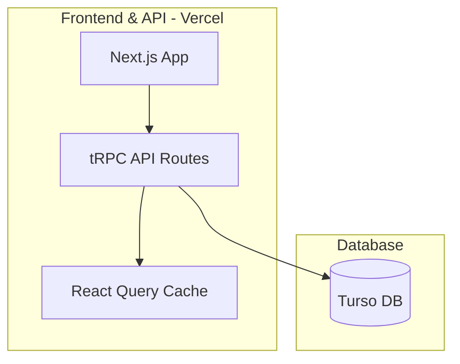

# dotkit marketplace

> [!CAUTION]
> dotkit is still in early development, and is not yet ready for use.
> expect breaking changes and bugs, the below is subject to change.

## tech stack

- [Next.js](https://nextjs.org) - React framework
- [Drizzle](https://orm.drizzle.team) - TypeScript ORM
- [tRPC](https://trpc.io) - End-to-end typesafe APIs
- [Tailwind CSS](https://tailwindcss.com) - CSS framework
- [NextAuth.js](https://next-auth.js.org) - Authentication
- [TypeScript](https://www.typescriptlang.org) - Type safety

## development phases

### phase 1: mvp foundation

- [ ] initialize t3 project with create-t3-app
- [ ] set up drizzle schema and migrations
  - start with users and modules tables only
- [ ] basic github oauth integration
- [ ] minimal layout with navigation
- [ ] simple vercel deployment

### phase 2: essential features

- [ ] basic user management
  - [ ] github login
  - [ ] simple profile page
- [ ] core module management
  - [ ] basic module submission form
  - [ ] module listing page
  - [ ] simple version tracking
- [ ] basic search
  - [ ] text search
  - [ ] simple category filter

### phase 3: community mvp

- [ ] basic engagement features
  - [ ] star modules
  - [ ] simple comments
- [ ] collections v1
  - [ ] create personal collections
  - [ ] add/remove modules

### phase 4: developer experience

- [ ] basic documentation
  - [ ] integration guide
  - [ ] api documentation
- [ ] simple cli tool
  - [ ] module installation
  - [ ] basic publishing

## database schema

```typescript
// User schema
export const users = pgTable("users", {
  id: serial("id").primaryKey(),
  name: text("name"),
  email: text("email").unique(),
  image: text("image"),
  githubId: text("github_id").unique(),
  createdAt: timestamp("created_at").defaultNow(),
});

// Module schema
export const modules = pgTable("modules", {
  id: serial("id").primaryKey(),
  name: text("name").notNull(),
  namespace: text("namespace").notNull(),
  description: text("description"),
  authorId: integer("author_id").references(() => users.id),
  githubUrl: text("github_url"),
  category: text("category").notNull(),
  downloads: integer("downloads").default(0),
  stars: integer("stars").default(0),
  createdAt: timestamp("created_at").defaultNow(),
  updatedAt: timestamp("updated_at").defaultNow(),
});

// Reviews schema
export const reviews = pgTable("reviews", {
  id: serial("id").primaryKey(),
  moduleId: integer("module_id").references(() => modules.id),
  userId: integer("user_id").references(() => users.id),
  rating: integer("rating").notNull(),
  comment: text("comment"),
  createdAt: timestamp("created_at").defaultNow(),
});

// Collections schema
export const collections = pgTable("collections", {
  id: serial("id").primaryKey(),
  name: text("name").notNull(),
  description: text("description"),
  userId: integer("user_id").references(() => users.id),
  isPublic: boolean("is_public").default(true),
  createdAt: timestamp("created_at").defaultNow(),
});

// Collection items schema
export const collectionItems = pgTable("collection_items", {
  id: serial("id").primaryKey(),
  collectionId: integer("collection_id").references(() => collections.id),
  moduleId: integer("module_id").references(() => modules.id),
  addedAt: timestamp("added_at").defaultNow(),
});
```

## api routes

### module management

```typescript
// Example tRPC router for modules
export const moduleRouter = createTRPCRouter({
  create: protectedProcedure
    .input(createModuleSchema)
    .mutation(async ({ ctx, input }) => {
      // Create new module
    }),
    
  getAll: publicProcedure
    .input(z.object({
      limit: z.number().min(1).max(100).default(10),
      cursor: z.number().nullish(),
    }))
    .query(async ({ ctx, input }) => {
      // Get paginated modules
    }),
    
  getById: publicProcedure
    .input(z.object({ id: z.number() }))
    .query(async ({ ctx, input }) => {
      // Get single module
    }),
});
```

## frontend components

### core components

- modulecard
- searchbar
- filterpanel
- userprofile
- modulesubmissionform
- reviewcomponent
- collectiongrid

### pages

- home/discovery
- module details
- user profile
- submit module
- collection view
- search results
- documentation

## architecture



### next.js configuration

```javascript
// next.config.js
module.exports = {
  // Default Next.js configuration
  reactStrictMode: true,
  swcMinify: true,
}
```

### performance optimizations (no edge functions)

- react query for client-side caching
- incremental static regeneration (isr) for popular pages
- debounced search with client-side filtering
- optimistic ui updates
- efficient pagination with cursor-based queries
- background revalidation of static pages

### rate limiting implementation

```typescript:src/server/api/trpc.ts
import { Redis } from '@upstash/redis'
import { Ratelimit } from '@upstash/ratelimit'

const redis = new Redis({
  url: process.env.UPSTASH_REDIS_URL,
  token: process.env.UPSTASH_REDIS_TOKEN,
})

const ratelimit = new Ratelimit({
  redis,
  limiter: Ratelimit.slidingWindow(100, '15 m'),
  analytics: true,
})

const withRateLimit = t.middleware(async ({ ctx, next }) => {
  const identifier = ctx.session?.user?.id || 
    ctx.req.headers['x-forwarded-for'] || 
    'anonymous'
    
  const { success, limit, remaining } = await ratelimit.limit(identifier.toString())

  if (!success) {
    throw new TRPCError({
      code: 'TOO_MANY_REQUESTS',
      message: `Rate limit exceeded. ${remaining} requests remaining. Try again in 15 minutes.`,
    })
  }
  
  return next()
})
```

## deployment

### infrastructure

- vercel
  - next.js hosting
  - api routes
  - edge functions (when needed)
  - automatic ci/cd
  - built-in monitoring

- database
  - turso distributed sqlite
  - edge-hosted replicas
  - automatic backups

- caching (optional)
  - upstash redis
  - vercel kv

### monitoring & operations

- application monitoring
  - vercel analytics
  - error tracking
  - performance monitoring
  - deployment logs

- database monitoring
  - turso dashboard
  - query performance
  - storage metrics

- backup strategy
  - daily turso backups
  - configuration backups
  - automated restore testing

### cost breakdown by scale

#### 0-5,000 users/month

- infrastructure
  - vercel: free tier
    - includes hosting, functions, and analytics
  - turso: free tier
    - metadata storage only (25m rows/month)
  - upstash redis: free tier (optional)
total: $0/month

#### 5,000-20,000 users/month

- infrastructure
  - vercel: pro tier ($20/month)
    - required for increased usage
  - turso: free tier (still within limits)
  - upstash redis: pro tier ($25/month, if needed)
total: $20-45/month

#### 20,000-100,000 users/month

- infrastructure
  - vercel: pro tier ($40/month)
  - turso: pro tier ($29/month)
    - required for increased row limits
  - upstash redis: business tier ($50/month, if needed)
total: $69-119/month

## future enhancements

### phase 5: advanced features

- [ ] module dependency visualization
- [ ] automated testing integration
- [ ] module compatibility checking
- [ ] advanced search with algolia
- [ ] real-time notifications
- [ ] module update webhooks

### phase 6: enterprise features

- [ ] team accounts
- [ ] private modules
- [ ] custom branding
- [ ] analytics dashboard
- [ ] api rate limiting
- [ ] sla guarantees
